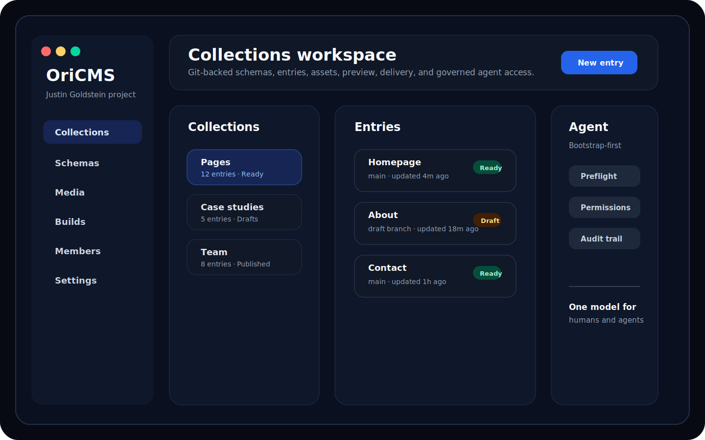

# OriCMS

OriCMS is a Git-backed CMS built around projects, collections, and explicit publishing workflows. The repository is the source of truth for schemas, entries, assets, and collection configuration; OriCMS provides the admin app, APIs, preview flow, delivery hooks, and agent controls around that repository.

<picture>
  <source media="(prefers-color-scheme: dark)" srcset="./docs/assets/oricms-workspace-preview.svg">
  
</picture>

## Project Status

OriCMS is in early public preview. The current repository is intended for technical review, architecture feedback, and early contributor interest while the core product surfaces continue to harden.

What works today:

- project-based content workspace with collections, schemas, assets, members, and settings surfaces
- Express + Prisma management API and delivery routes
- React + Vite admin app backed by shared TypeScript contracts
- governed Agent Gateway for bootstrap-first context, preflight checks, and permission-aware agent operations
- package-local verification scripts for API, web, shared contracts, client, CLI, and adapters

Still in progress:

- production deployment guidance and release packaging
- deeper contributor onboarding and issue triage
- additional examples, screenshots, and integration recipes
- continued polish of first-run and empty-state experiences

Feedback wanted:

- Git-backed CMS architecture and repository layout
- project, collection, and workflow model clarity
- agent gateway design, safety boundaries, and developer ergonomics
- local setup friction or missing contributor documentation

## Repository Layout

```text
packages/
  api/                Express + Prisma backend
  web/                React + Vite admin app
  shared/             Shared contracts, validation, and types
  client/             TypeScript SDK
  cli/                Command-line tooling
  adapters/astro/     Astro adapter
  adapters/nextjs/    Next.js adapter
docs/                 Canonical documentation
examples/             Runnable and copyable examples
```

## Local Development

Requirements:

- Node.js 20+
- npm 10+
- Docker
- Git

Setup:

```bash
nvm use
npm install
cp .env.example .env
cp packages/api/.env.example packages/api/.env
docker-compose up -d postgres
npm run build -w @ori/shared
npm run db:generate -w @ori/api
npm run db:migrate -w @ori/api
npm run db:verify-migrations -w @ori/api
```

Use the compose stack for Postgres in local development, then run the API and web app with `npm run dev`. Starting the compose `api` and `web` services at the same time will conflict on ports `3001` and `5173`.

Start the stack:

```bash
npm run dev
```

Default local URLs:

- admin app: `http://localhost:5173`
- API: `http://localhost:3001`

## Verification

Run the standard repository check:

```bash
npm run verify
```

Useful package-level commands:

```bash
npm run type-check -w @ori/api
npm run test -w @ori/api
npm run build:check -w @ori/web
npm run test -w @ori/web
npm run test:e2e:fullstack -w @ori/web
npm run build -w @ori/shared
```

## API Shape

The active API surface is project-based:

- management routes: `/api/v1/projects/*`
- delivery routes: `/api/v1/delivery/projects/:projectId/*`
- agent gateway: `/api/v1/agent/v1/*`

## Documentation

Start here:

- [docs/README.md](./docs/README.md)
- [docs/getting-started/README.md](./docs/getting-started/README.md)
- [docs/reference/api-overview.md](./docs/reference/api-overview.md)
- [docs/contributor/README.md](./docs/contributor/README.md)

## License

OriCMS is licensed under the [MIT License](./LICENSE).
